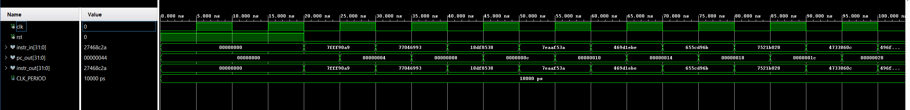
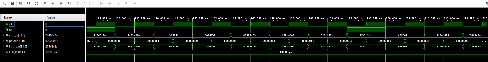
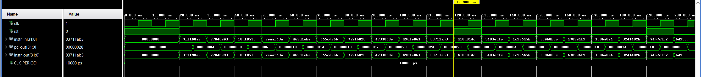

# INSTRUCTION_FETCH

## Overview
This project implements a basic Instruction Fetch (IF) stage in VHDL for a 5-stage pipelined RISC-V CPU. The IF module generates the program counter (`pc_out`), increments it by 4 each cycle, and forwards a 32-bit instruction (`instr_in`) to the Decode stage (`instr_out`). This module focuses solely on sequential instruction flow and does not yet implement branching, flushing, or stalling.

## Features
- 32-bit program counter with synchronous reset
- PC increments by 4 every clock cycle
- Transparent passthrough of fetched instruction
- Clean design for integration with instruction memory and decode stage

## Project Structure
INSTRUCTION_FETCH/
- function_dec_def
    - fuction_definition.vhd
    - reusable_function.vhd
- images/
    - tcl.png
    - wave1.png
    - wave2.png
    - counter_reset.png
- src/
    - INST_FETCH.vhd
- test_bench/
    - tb_INST_FETCH.vhd
- .gitignore/
- LICENSE
- README.md/

## Testbench Strategy
A single randomized testbench is provided:
- **tb_INST_FETCH.vhd** — Randomly generates 32-bit instruction inputs and verifies:
  - PC increments by 4 every clock cycle
  - PC resets to zero when `rst = '1'`
  - `instr_in` is correctly passed to `instr_out`

## Key Learnings
- Learned that increasing the clock period (slowing down the clock) helps with debugging by making waveform transitions easier to observe. Once debugging is complete, decreasing the clock period improves simulation speed and better reflects real CPU timing.
- Gained experience writing reusable VHDL functions and organizing them into packages for cleaner, more maintainable testbenches.

## Simulation Results
### Tcl Console Output
Shows that the randomized testing was successful
 

### Waveform Example
Shows that the instructions in and out are equal
 
 
PC counter resets
 

## How to Run

1. Launch **Vivado 2019** or newer
2. Open the project or create a new one and add the src and a test bench file.
3. Set the testbench file as the top-level simulation unit.
4. Run the simulation:
    - Go to Flow → Run Simulation → Run Behavioral Simulation
    - Or use the project manager's simulation shortcut.
5. View signals in the Waveform Viewer and test status in the Tcl Console.

## Author
**Noridel Herron** (@MIZZOU)  
Senior in Computer Engineering  
noridel.herron@gmail.com

## Contributing
This is a personal academic project. Suggestions, issues, and improvements are welcome through GitHub.

## License
MIT License

## Author
**Noridel Herron** (@MIZZOU)  
Senior in Computer Engineering  
noridel.herron@gmail.com

## Disclaimer
This project is developed solely for educational and personal learning purposes.  
It may contain unfinished or experimental features and is not intended for commercial or production use.
