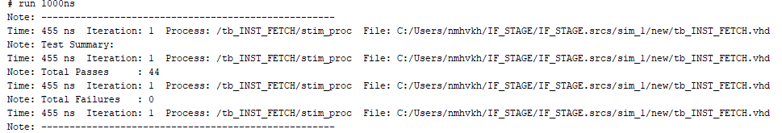

# INSTRUCTION_FETCH

## Overview
This project implements a basic Instruction Fetch (IF) stage in VHDL for a 5-stage pipelined RISC-V CPU. The IF module maintains an internal program counter (PC), increments it by 4 each cycle, and fetches a 32-bit instruction from an internal read-only memory (ROM). The fetched instruction is then forwarded to the Decode stage via instr_out. This module supports only sequential instruction flow and does not yet implement branching, flushing, or pipeline stalling.

## Features
- 32-bit program counter with synchronous reset
- PC increments by 4 every clock cycle 
- Clean design for integration with instruction memory and decode stage

## Internal Module
**INST_MEM** https://github.com/NoridelHerron/MEMORY_MODULE
    - Take PC counter
    - Return instruction 
    
## Project Structure
INSTRUCTION_FETCH/
- customized_function
    - **Noridel_function.vhd** - customize function declaration
    - **Noridel_fuction_def.vhd** - function definition    
- images/
    - tcl.png  
- src/
    - INST_FETCH.vhd
    - INST_MEM
- test_bench/
    - tb_INST_FETCH.vhd
- .gitignore/
- LICENSE
- README.md/

## Testbench Strategy
- used fixed input same as what's in the memory:
- PC increments by 4 every clock cycle
- PC resets to zero when `rst = '1'` 

## Key Learnings
- Learned that increasing the clock period (slowing down the clock) helps with debugging by making waveform transitions easier to observe. Once debugging is complete, decreasing the clock period improves simulation speed and better reflects real CPU timing.
- Gained experience writing reusable VHDL functions and organizing them into packages for cleaner, more maintainable testbenches.

## Simulation Results
### Tcl Console Output
Shows that the randomized testing was successful
 

## How to Run

1. Launch **Vivado 2019** or newer
2. Open the project or create a new one and add the src, function_dec_def and a test bench file.
3. Set the testbench file as the top-level simulation unit.
4. Run the simulation:
    - Go to Flow → Run Simulation → Run Behavioral Simulation
    - Or use the project manager's simulation shortcut.
5. View signals in the Waveform Viewer and test status in the Tcl Console.

## Author
**Noridel Herron** (@MIZZOU)  
Senior in Computer Engineering  
noridel.herron@gmail.com

## Contributing
This is a personal academic project. Suggestions, issues, and improvements are welcome through GitHub.

## License
MIT License

## Author
**Noridel Herron** (@MIZZOU)  
Senior in Computer Engineering  
noridel.herron@gmail.com

## Disclaimer
This project is developed solely for educational and personal learning purposes.  
It may contain unfinished or experimental features and is not intended for commercial or production use.
